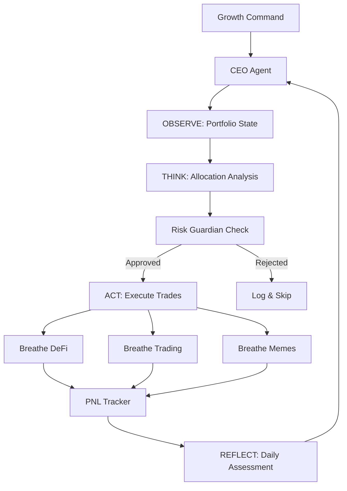

# 🧠 The Breathe Brain: Architecture of Autonomous Capital

Breathe operates using a modular, multi-agent architecture designed for autonomous capital growth across multiple chains and strategies.

## 🔬 Multi-Agent Architecture

### CEO Agent — The Decision Maker
Central orchestrator that allocates capital, monitors performance, and adjusts strategy. Runs the core ReAct (Reasoning + Acting) loop:

1. **OBSERVE** — Assess portfolio state, market conditions, yield opportunities
2. **THINK** — Analyze allocation drift, identify rebalancing needs
3. **DECIDE** — Filter actions through Risk Guardian, check spending limits
4. **ACT** — Execute approved trades via strategy-specific engines
5. **REFLECT** — Log results, update PNL, adjust strategy parameters

### Risk Guardian — The Watchdog
Safety agent with **veto power** over any transaction:
- Position size limits (max 10% per trade, 2% for memes)
- Leverage caps (max 3x)
- Protocol risk scoring
- Drawdown monitoring (auto-kill at 15%)
- Portfolio concentration limits (max 40% in one protocol)

### Yield Agent — The DeFi Specialist
Scans Base Mainnet DeFi protocols for optimal yield:
- Aave V3 (lending)
- Morpho Blue (optimized lending)
- Aerodrome (LP + gauges)
- Uniswap V3 (concentrated liquidity)

### Trading Engine — The Alpha Generator
Perpetual futures + prediction markets:
- GMX V2 / Synthetix Perps on Base (max 3x leverage)
- Polymarket prediction bets (expected value calculation)

### Meme Sniper — The Degen
Solana meme token momentum trading:
- pump.fun bonding curve detection
- Jupiter/Raydium swaps
- Rug-pull detection (holder analysis, LP lock check)
- Auto exit at 3x or -30%

## 🛠️ Decision Flow

## 🔒 Treasury Reasoning Loop

When the CEO Agent receives a "grow capital" command:

1. Check kill switch status
2. Read current portfolio state
3. Compare actual vs target allocation
4. Generate rebalance actions for drifted strategies
5. Pass each action through Risk Guardian validation
6. Check against daily spending limit
7. Execute approved actions via strategy engines
8. Log all transactions to audit trail
9. Update PNL tracker
10. Generate daily reflection report

## 📈 Evolution Path

Breathe is designed to be extensible:
- New strategy modules can be added without changing the core
- Risk parameters are fully configurable via environment
- PNL tracking enables data-driven strategy improvements
- Daily reflection enables self-improving behavior

---
Brain Architecture v2.0.0
